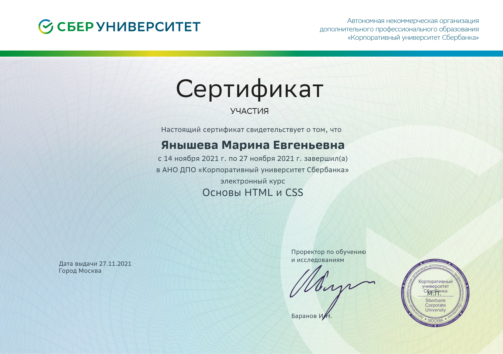
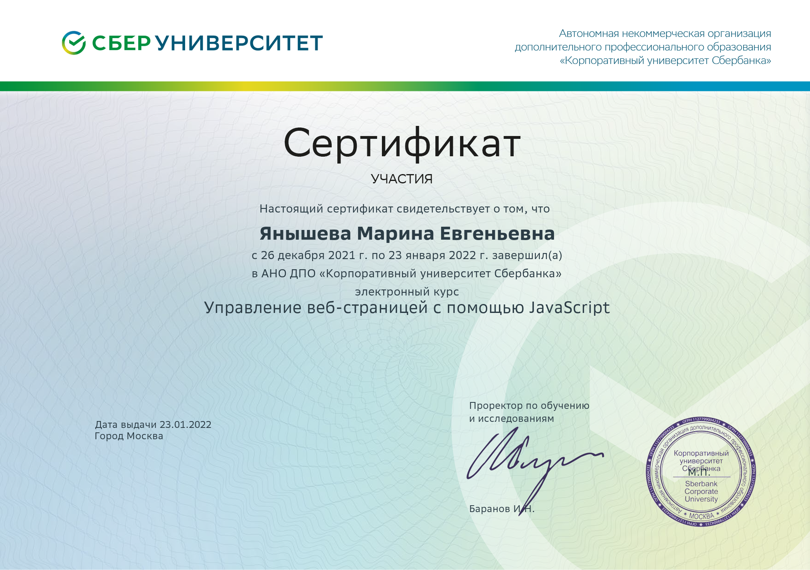
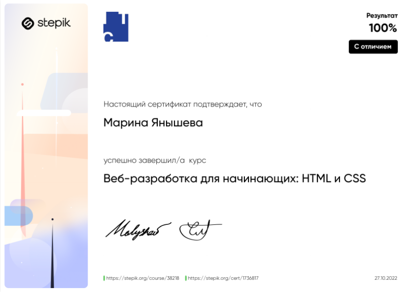
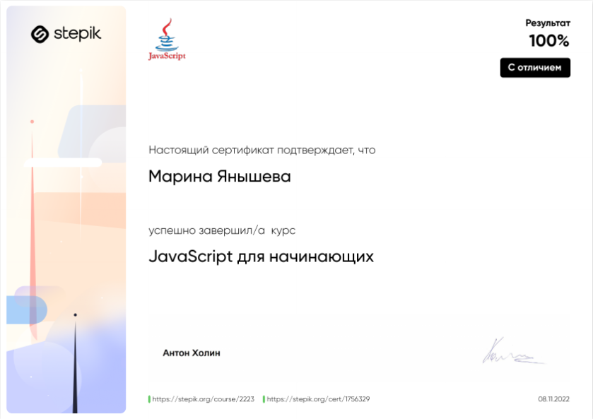
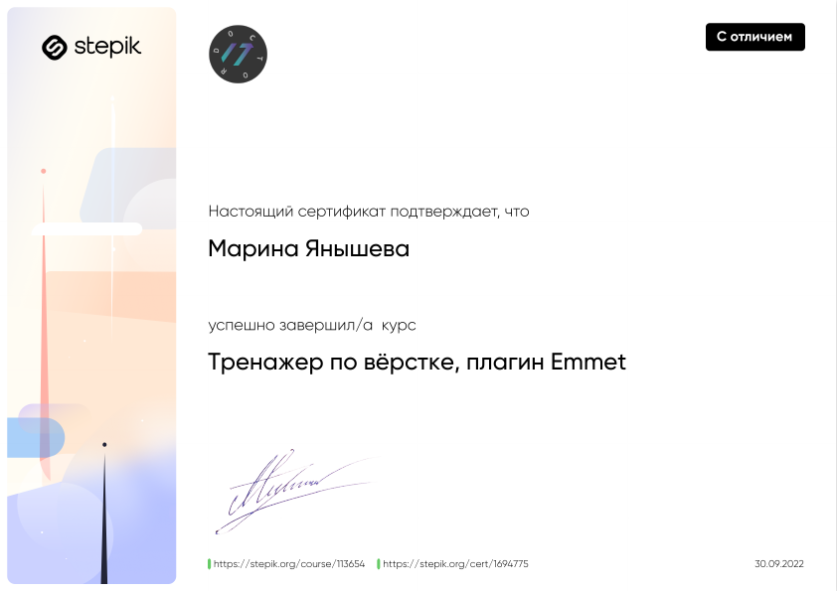
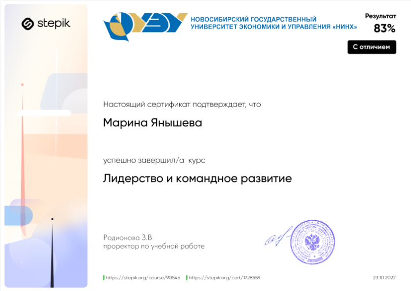
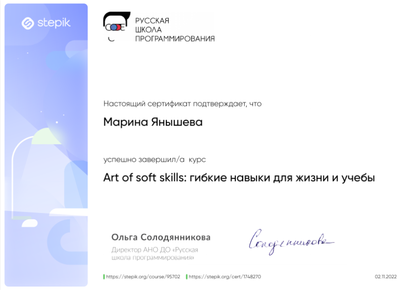
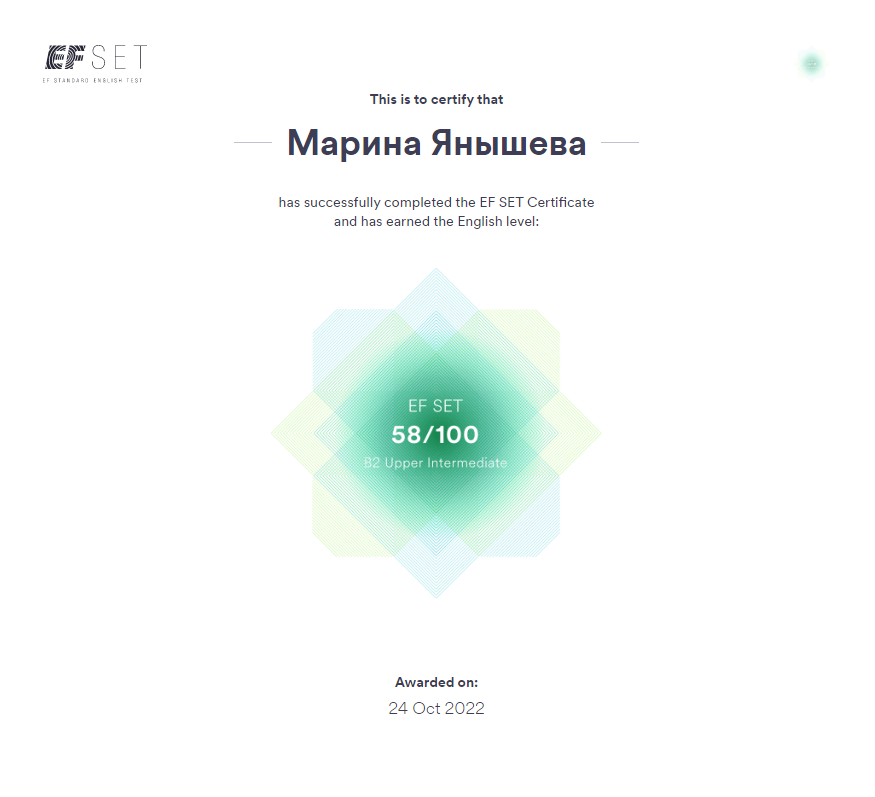
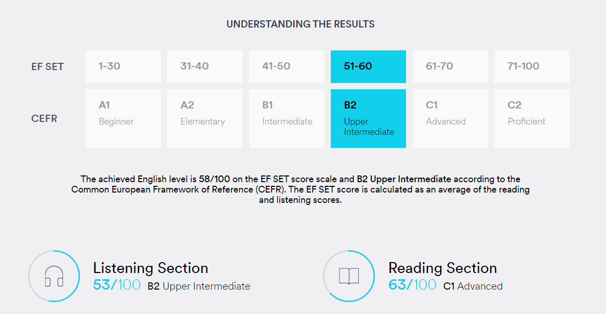

___
# Marina Yanysheva
### *Frontend developer*


___

### Contact Information:
**Location:** Tbilisi, Georgia  
**Phone:** +995 551 077 409  
**E-mail:** m.yanysheva@inbox.ru  
**Telegram:** @marikafikys  
[LinkedIn](https://www.linkedin.com/in/marina-yanysheva/)
[GitHub](https://github.com/marikafikys)

___

### About Me:
After 6 years of experience in the power industry and relay protection, in 2021 I became interested in front-end development and am very happy to develop in this direction.
I want to serve the world by creating and maintaining optimally functional websites and applications as tools to achieve the mission and vision of companies.

At the moment I am open to everything that will allow me to gain experience and improve my knowledge in the field of web development.

I will be glad to cooperate! :)

___

### Skills & Proficiency:
- HTML5
- CSS3
- JavaScript
- ReactJS
- Git, GitHub

___

### Code Example:
***RGB To Hex Conversion KATA from CODEWARS (5kyu):***
*The rgb function is incomplete. Complete it so that passing in RGB decimal values will result in a hexadecimal representation being returned. Valid decimal values for RGB are 0 - 255. Any values that fall out of that range must be rounded to the closest valid value. Note: Your answer should always be 6 characters long, the shorthand with 3 will not work here.*
```
function rgb(r, g, b){
	let hexstring = "";
	let rgb = [r, g, b];
	 rgb.forEach(num => {
		 let hexnumber = Math.min(Math.max(num, 0), 255).toString(16).toUpperCase();
		 hexnumber.length > 1 ? hexstring += hexnumber : hexstring += "0" + hexnumber;
	 });
	  return hexstring;  
 }
```
___

### Experience:
#### My projects
- ***Green Corp Landing:*** https://marikafikys.github.io/green-corp-landing/  
  Layout, stylization, animation.  
  ***Stack:** HTML, CSS, JavaScript: Canvas, animation.*  
- ***React Quiz:*** https://marikafikys.github.io/react-quiz/  
  React app.  
  ***Stack:** SCSS, JavaScript, React, JSX*

___

### Education:
**ANO DPO "Corporate University of Sberbank", Frontend Java Script Developer**  
Professional retraining program "Frontend developer in Java Script": obtaining competencies in HTML and CSS layout, Java Script programming (training, practice, graduation project defense).

- Layout of adaptive web pages using HTML and CSS;
- Creation of interactive elements on the site using Java Script;
- Creation of frontend applications using ReactJS;
- Introduction to Webpack;
- GIT, GitHub, GitHub Pages.

**Certificates:**





___

### Courses:
**Hard Skills**
- "Web Development for Beginners: HTML and CSS" on [Stepik](https://stepik.org/)

- "JavaScript for beginners" on [Stepik](https://stepik.org/)

- "Layout simulator, plugin Emmet" on [Stepik](https://stepik.org/)

- "Developing web applications with Node.js" on [Stepik](https://stepik.org/) (in progress)
- JavaScript Manual on [learnjavascript.ru](learnjavascript.ru) (in progress)
- RS Schools Course "JavaScript/Front-end. Stage 0" (in progress)
  
**Soft Skills**
- "Leadership and team development" on [Stepik](https://stepik.org/):  
   *personality, motivation, stress and burnout, leadership, team, conflict, facilitation.*  
	
- "Art of soft skills: гибкие навыки для жизни и учебы" on [Stepik](https://stepik.org/):  
  *emotional intellect, teamwork, adaptability, conflict resolution, successful self-positioning.*  
  
  
___

### Languages:
- Russian: Native Speaker
- English: Upper Intermediate  
  **Certificate:**
[The EF Standard English Test (EF SET)](https://www.efset.org/cert/1XZ9Ze)

